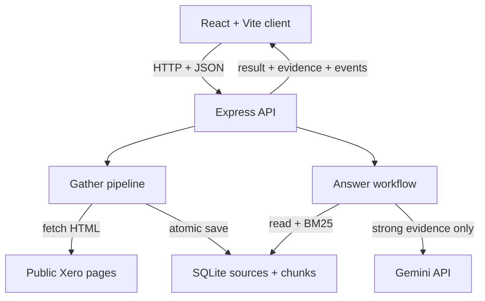

# Xero Research Assistant

[中文说明](README.zh-CN.md)

A local-first TypeScript research application that gathers selected public Xero Australia pages, stores traceable evidence, retrieves relevant passages, and asks Gemini to draft answers that the backend validates against those passages.

The reviewer can use one web page to inspect sources and retrieval times, gather or refresh research, ask questions, expand supporting evidence, open source URLs, and inspect workflow or failure events.

## What the application does

- Gathers four configured public Xero Australia pages.
- Removes common HTML noise, splits useful text into bounded chunks, and stores sources and chunks in SQLite.
- Reuses stored research during normal Gather operations and never fetches pages while answering a question.
- Ranks stored chunks with lexical BM25 and returns the Top 5 candidates.
- Calls Gemini only when retrieval has sufficient query coverage.
- Rejects malformed answers, unknown evidence IDs, and citation-list/inline-marker mismatches.
- Preserves last-known-good evidence when a refresh fails.
- Exposes source, retrieval, model, reuse, refresh, and failure activity in the UI.

## Fresh-clone setup

### Requirements

- Node.js 22.13 or newer; the project uses Node's built-in `node:sqlite` module.
- npm, included with Node.js.
- A Gemini API key only for supported model-backed answers and live evaluation. Gathering, inspection, retrieval, the safe-failure demonstration, type checking, building, and offline tests do not require a key.

### Install and configure

```bash
git clone https://github.com/XiangXuX/xero-research-assistant.git
cd xero-research-assistant
npm install
```

Create the local environment file:

```powershell
# Windows PowerShell
Copy-Item .env.example .env
```

```bash
# macOS or Linux
cp .env.example .env
```

Add a Gemini API key to `.env` if model-backed answers are required:

```dotenv
GEMINI_API_KEY=your_key_here
```

Create a key in [Google AI Studio](https://aistudio.google.com/app/apikey). A ChatGPT subscription does not provide this credential. `.env` is excluded from Git; `.env.example` is committed as a safe template.

## Environment variables

| Variable | Default | Purpose |
| --- | --- | --- |
| `PORT` | `3001` | Express API port. |
| `RESEARCH_DB_PATH` | `data/research.db` | Local SQLite database file. |
| `FETCH_TIMEOUT_MS` | `45000` | Timeout for each page request. |
| `MODEL_PROVIDER` | `gemini` | Runtime provider selection; only Gemini is implemented. |
| `MODEL_NAME` | `gemini-3.1-flash-lite` | Gemini model sent to the provider API. |
| `MODEL_TIMEOUT_MS` | `30000` | Timeout for each model request. |
| `GEMINI_API_KEY` | empty | Secret used only by Express when Gemini is called. |

## Run the live application

```bash
npm run dev
```

Open [http://localhost:5173](http://localhost:5173). Vite serves the React client on port 5173 and proxies `/api` to Express on [http://localhost:3001](http://localhost:3001). The API does not serve a page at `/`, so opening port 3001 directly may show `Cannot GET /`; that is expected. Stop both processes with `Ctrl+C` in the terminal running `npm run dev`.

### Gather, refresh, inspect, and ask

| Operation | Web UI | CLI | External activity |
| --- | --- | --- | --- |
| Gather or reuse | **Gather research** | `npm run research:gather` | Fetches and processes only an incomplete or missing configured source; otherwise reuses SQLite. |
| Force refresh | **Refresh all** | `npm run research:refresh` | Fetches and reprocesses every configured Xero page. |
| Inspect storage | **View stored chunks** | `npm run research:inspect` | Reads SQLite only. |
| Inspect retrieval | Supporting Evidence | `npm run research:retrieve -- "What pricing plans does Xero offer in Australia?"` | Reads SQLite only; no Xero or Gemini request. |
| Ask with evidence | **Ask with evidence** | `npm run research:ask -- "What pricing plans does Xero offer in Australia?"` | Reads SQLite; calls Gemini only for strong retrieval; never fetches Xero. |

Sources are defined in `src/server/research/sources.ts`. Normal Gather reports `SOURCE_REUSED` when a complete record exists. Explicit Refresh updates `retrievedAt` only after a successful replacement.

## Architecture and data flow



### Gather and refresh

1. React sends `POST /api/research/gather` with `{ "refresh": false }` for Gather or `{ "refresh": true }` for Refresh.
2. Express validates the request and calls the gather service.
3. Normal Gather reuses a complete record. Refresh, or a missing record, downloads HTML from the configured URL.
4. Cheerio removes scripts, navigation, forms, cookie/modal elements, and other page noise, then extracts headings, paragraphs, lists, and table text.
5. The chunker produces passages of at most 1,200 characters, with up to 180 characters of paragraph overlap where possible.
6. A SHA-256 content hash is calculated. The source and replacement chunks are committed in one SQLite transaction.
7. Express returns JSON with fetched, reused, and failed counts plus per-source events; React renders the response.

### Question and answer

1. React sends `POST /api/research/answer` with `{ "question": "..." }`.
2. Express rejects an empty or overlong question.
3. The answer service reads existing chunks from SQLite; it cannot call the page fetcher or chunker.
4. BM25 tokenises the question, applies small synonym expansions and metadata boosts, ranks the corpus, and returns at most five chunks labelled `E1` to `E5`.
5. Query-term coverage classifies retrieval as `strong`, `weak`, or `none`. Weak or absent evidence returns `insufficient_evidence` without Gemini.
6. For strong retrieval, only the question and Top 5 passages are sent to Gemini. It proposes structured JSON containing an answer, citation IDs, and an insufficient-evidence flag.
7. Backend code validates the JSON, permits only supplied IDs, and requires inline markers such as `[E1]` to exactly match the citation array.
8. Valid IDs are mapped to stored titles, URLs, retrieval times, and exact passages. The backend returns the answer, evidence, retrieval/model metadata, and workflow events to React.

Evidence is assembled by the backend because it owns the retrieved records and the allow-list of valid IDs. The browser therefore cannot invent a citation or attach a different passage to an answer.

## HTTP API

| Method and path | Purpose | Important responses |
| --- | --- | --- |
| `GET /api/health` | Confirms that the API is running. | `200` |
| `GET /api/research` | Lists stored sources. | `200` |
| `POST /api/research/gather` | Gathers or force-refreshes sources. | `200`; per-source failures are included in the result |
| `POST /api/research/retrieve` | Returns ranked evidence without a model call. | `200`, `400` |
| `POST /api/research/answer` | Runs grounded question answering. | `200`, `400`, `502`, `503` |
| `GET /api/research/sources/:sourceId` | Returns one stored source and its chunks. | `200`, `400`, `404` |
| `POST /api/research/demo/refresh-failure` | Runs the synthetic HTTP 503 safety demonstration. | `200`, or `409` without stored research |

`400` means invalid input, `404` means a source does not exist, `409` means the demonstration cannot run in the current state, `502` means a model/upstream execution or validation failure, and `503` means the model is not configured. Unhandled internal failures use `500`. Controlled error responses do not contain the API key.

## Persistence, reuse, and refresh safety

The default database is `data/research.db`, a local SQLite file excluded from Git.

- `sources` stores key, URL, title, successful retrieval time, SHA-256 hash, and cleaned full text. Integer `id` is the primary key; keys and URLs are unique.
- `chunks` stores passage text, position, and a `source_id` foreign key. A source cannot have two chunks at the same position.
- Foreign keys are enabled and source deletion cascades to chunks. WAL mode and a five-second busy timeout are enabled.

Normal Gather reuses stored sources and chunks without web requests or processing. Questions always read those chunks, although each supported question may make a new Gemini call and produce different wording.

Refresh fetches, extracts, and chunks first; it replaces the record only when new material is ready. Source/chunk replacement uses `BEGIN IMMEDIATE`, `COMMIT`, and `ROLLBACK`. A failed download or extraction leaves content, hash, chunks, and successful `retrievedAt` unchanged. The UI separately shows the last attempted refresh and last successful retrieval.

## Offline tests

```bash
npm test
npm run typecheck
npm run build
```

The current suite contains 21 Vitest tests across five files. It covers retrieval ranking and Top K, extraction and chunk bounds, SQLite persistence, source replacement, reuse without fetch/processing, insufficient evidence, repeated model calls without refetching, invalid model output/citations, provider failures, failed-refresh preservation, and the four evaluation-case rules.

Tests require no key and make no Xero or Gemini request. Local HTML fixtures, injected mock fetch functions, in-memory SQLite, and a stub model replace external boundaries. Real extraction, chunking, repository, retrieval, workflow, and citation-validation code still runs; this is not a mock-only application.

Verified record: [`evaluation/step-8-offline.json`](evaluation/step-8-offline.json).

## Evaluation

Automated tests prove deterministic software behaviour. Evaluation checks whether real model answers are supported by supplied evidence; valid JSON alone cannot prove semantic correctness.

After gathering research and configuring `GEMINI_API_KEY`, run:

```bash
npm run evaluation:live
```

| Case | What it checks |
| --- | --- |
| Supported | One source directly supports the answer. |
| Multi-source | The answer combines evidence from multiple sources. |
| Insufficient evidence | Weak retrieval refuses explicitly and makes no model call. |
| Repeated/follow-up | Retrieval dates remain unchanged while a supported follow-up can call the model again. |

The command writes [`evaluation/real-model-run.json`](evaluation/real-model-run.json): questions, expectations, complete relevant evidence, outputs, assessments, model/configuration, run date, and retrieval dates. No key is recorded. The committed run passed all four cases, observed three model calls, and confirmed unchanged retrieval dates. A reviewer should still confirm that each material claim is entailed by its cited passages.

## Design decisions

### 1. SQLite instead of an external database

**Choice.** Store source metadata, cleaned text, and chunks in one local SQLite file through Node's built-in API.

**Alternative.** A managed PostgreSQL, MongoDB, or other cloud database.

**Why it fits now.** This is a single-user local MVP with four sources. SQLite provides persistence, constraints, foreign keys, and transactions without accounts, network setup, infrastructure cost, or another process.

**Reconsider when.** Move when concurrent users or server instances need shared state, managed backup/high availability is required, or single-machine operational limits are reached.

### 2. Lexical BM25 instead of embeddings/vector search

**Choice.** Tokenise chunks in application code and rank them with BM25 plus small synonym and source-metadata boosts.

**Alternative.** Generate embeddings and use a vector database, or combine lexical and vector retrieval.

**Why it fits now.** The corpus is small and product terms usually appear in both questions and sources. BM25 is deterministic, inspectable, fast at this scale, offline, credential-free, and has no embedding/vector-hosting cost.

**Reconsider when.** Adopt vector or hybrid retrieval when linear scanning becomes slow, paraphrases cause poor recall, multilingual retrieval is required, or measured evaluation shows inadequate retrieval quality.

## AI usage

### Runtime AI

The implemented provider is Google Gemini, accessed server-side through the Gemini Interactions API using `GEMINI_API_KEY`. The default model is `gemini-3.1-flash-lite`. Requests use structured JSON, an 800-token output limit, minimal thinking, no requested provider-side storage, and a 30-second timeout.

Gemini is a constrained answer proposer, not the source of truth. Deterministic code decides whether evidence is strong, which passages are supplied, which IDs are legal, whether output is valid, and which stored passages reach the browser.

### Development AI

ChatGPT/Codex supported planning, implementation, debugging, test design, evaluation design, and documentation. AI-assisted work was checked against the repository, automated tests, real-model evaluation, and manual evidence review. No development-assistant credential is needed at runtime.

## Cost and external calls

| Action | Xero request | Gemini request | Reuses research |
| --- | --- | --- | --- |
| First Gather | For missing/incomplete sources | No | Any complete source |
| Later normal Gather | No when all sources are complete | No | Yes |
| Refresh all | Once per configured source | No | Old data only when replacement fails |
| Retrieve | No | No | Yes |
| Ask, strong | No | Yes | Yes |
| Ask, weak/none | No | No | Yes |
| Offline tests | No | No | Fixtures/mocks/in-memory SQLite |
| Live evaluation | No page fetch inside answer cases | Three calls in the committed run | Yes |

Xero requests consume bandwidth/time and depend on site availability. Gemini calls consume provider quota and may incur charges under the Google account's current pricing. The application reports token usage when available but does not calculate money.

With more data, the main local costs are storing/rechunking more text and linearly scoring more chunks. Model input is bounded to Top 5 passages, but passage length and repeated supported questions still affect token usage.

## Current limitations

- Local development only; no cloud deployment or public URL.
- No authentication, authorisation, user separation, rate limiting, or production secret management.
- Four fixed public HTML sources; no user-managed list, scheduler, crawler, or JavaScript-rendering browser.
- Extraction depends on page structure and may need maintenance after markup changes.
- Lexical retrieval can miss semantic matches with different vocabulary; this is not vector search.
- Strength uses query-term coverage heuristics, not a trained relevance classifier.
- Citation validation checks structure and legal IDs, not full semantic entailment; human evaluation remains necessary.
- SQLite and in-memory corpus scoring are not intended for high concurrency or very large corpora.
- Refresh is transactional per source, not across all sources: a failed source is retained while others may update.
- The project does not calculate Gemini currency cost or guarantee provider/site availability.

## Project map

```text
src/client/                 React UI and browser API calls
src/server/routes/          Express HTTP validation and responses
src/server/research/        Fetch, extraction, chunking, storage, gather/refresh
src/server/retrieval/       BM25 retrieval and coverage classification
src/server/model/           Gemini, answer workflow, citation validation
src/server/evaluation/      Four-case live evaluation runner
src/shared/                 Shared TypeScript request/response/event contracts
tests/                      Offline Vitest unit and integration tests
evaluation/                 Verification and real-model records
data/                       Local SQLite; database files are ignored by Git
```

## Demo video

Pending — add the final recording URL here before submission.
