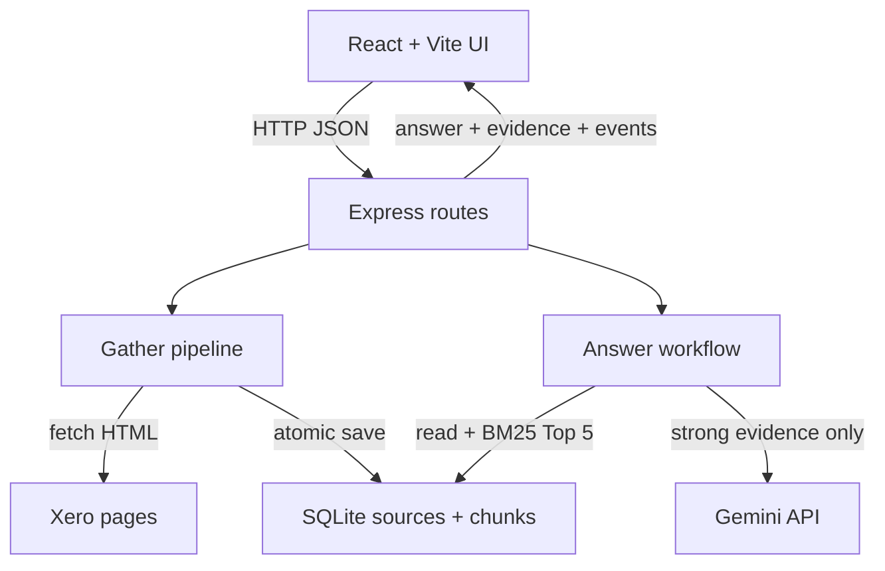

# Xero Research Assistant

An evidence-grounded research application built with React, TypeScript, Express, SQLite and Gemini. It collects a small, explicit set of public Xero Australia pages, keeps the source text locally, retrieves relevant passages with BM25 and returns answers with citations that can be checked against the stored evidence.

[Watch the 3-minute demo](https://youtu.be/veR7dywnl0g)

## What this project demonstrates

- An end-to-end typed path from React input to an Express API, retrieval workflow, model call and cited response
- Local persistence with SQLite transactions and last-known-good data protection
- Deterministic BM25 retrieval before generation, rather than sending an entire corpus to an LLM
- Runtime model boundaries: insufficient evidence skips Gemini, and invalid citations are rejected
- Offline unit and integration-style tests at network, database and model boundaries
- Evaluation artifacts that record retrieval, model activity, evidence and failure behaviour

## Setup and usage

### Requirements

- Node.js 22.13+ (required by the built-in `node:sqlite` module)
- npm
- A Gemini API key for real model answers and live evaluation only

```bash
git clone https://github.com/XiangXuX/xero-research-assistant.git
cd xero-research-assistant
npm install
```

Create the local configuration file:

```powershell
# Windows PowerShell
Copy-Item .env.example .env
```

```bash
# macOS/Linux
cp .env.example .env
```

Set `GEMINI_API_KEY=your_key_here` in `.env` for real model calls; obtain it from [Google AI Studio](https://aistudio.google.com/app/apikey). A ChatGPT subscription does not provide it. Git excludes `.env` and `data/*.db`.

| Variable | Default | Purpose |
| --- | --- | --- |
| `PORT` | `3001` | Express API port |
| `RESEARCH_DB_PATH` | `data/research.db` | SQLite database path |
| `FETCH_TIMEOUT_MS` | `45000` | Per-page timeout |
| `MODEL_PROVIDER` | `gemini` | Implemented runtime provider |
| `MODEL_NAME` | `gemini-3.1-flash-lite` | Runtime model |
| `MODEL_TIMEOUT_MS` | `30000` | Per-model-call timeout |
| `GEMINI_API_KEY` | empty | Server-only credential |

Run the web application:

```bash
npm run dev
```

Open [http://localhost:5173](http://localhost:5173). Vite serves React on 5173 and proxies `/api` to Express on 3001. `Cannot GET /` at port 3001 is expected because the API has no root page. Stop both processes with `Ctrl+C`.

| Task | UI | CLI | Network/model behaviour |
| --- | --- | --- | --- |
| Gather/reuse | **Gather missing** | `npm run research:gather` | Fetches only missing/incomplete sources; otherwise reuses SQLite |
| Force refresh | **Refresh all** | `npm run research:refresh` | Refetches and reprocesses all four pages |
| Inspect data | **Inspect evidence** | `npm run research:inspect` | SQLite only |
| Retrieve | Supporting Evidence | `npm run research:retrieve -- "What pricing plans does Xero offer in Australia?"` | SQLite only |
| Ask | **Ask with evidence** | `npm run research:ask -- "What pricing plans does Xero offer in Australia?"` | Never fetches Xero; calls Gemini only for strong retrieval |

Sources are configured in `src/server/research/sources.ts`. Add or replace a source there using a unique key and URL.

## System design



**Gather path.** `gatherResearch` reuses complete stored sources unless refresh is explicit. Otherwise it fetches HTML, removes common noise with Cheerio, creates passages of at most 1,200 characters, hashes the content, and saves it through `ResearchRepository`. Each source and its replacement chunks commit in one SQLite transaction. Failed refreshes preserve the previous content and successful `retrievedAt`; the UI distinguishes attempts from successful retrievals.

**Answer path.** `answerQuestion` reads stored chunks only. Lexical BM25, small synonym/metadata boosts, and query-term coverage select up to five passages labelled `E1`–`E5`. Weak evidence returns `insufficient_evidence` without Gemini; strong evidence sends the question and Top 5. The validator rejects malformed JSON, unknown IDs, missing citations, and mismatched inline markers. The backend maps valid IDs to stored text, title, URL, and date, preventing the browser from inventing evidence.

SQLite persists a `sources` row (key, URL, title, retrieval time, SHA-256, cleaned text) and ordered `chunks` linked by `source_id`. Asking and normal Gather reuse these records. A supported question may still make a new Gemini call.

## Project structure

```text
src/
├── client/
│   ├── components/       # research library, grounded answer, source and activity views
│   ├── lib/              # browser API helper and UI types
│   └── App.tsx           # application state and workflow orchestration
├── server/
│   ├── database/         # SQLite schema and repository
│   ├── evaluation/       # repeatable workflow evaluation
│   ├── model/            # Gemini provider, prompt and answer validation
│   ├── research/         # fetching, extraction, chunking and refresh protection
│   ├── retrieval/        # BM25 ranking and evidence selection
│   └── routes/           # Express API endpoints
└── shared/               # request and response contracts
```

## Tests and evaluation

Offline verification needs no API key or external access:

```bash
npm test
npm run typecheck
npm run build
```

The 21 Vitest tests use local HTML fixtures, mock fetch, in-memory SQLite, and a stub model at external boundaries while exercising real application logic. They cover reuse, insufficient evidence, ranking, persistence, invalid model output, repeated calls without refetching, and failed-refresh preservation. See [`evaluation/step-8-offline.json`](evaluation/step-8-offline.json).

After gathering live sources and setting the key, run:

```bash
npm run evaluation:live
```

This runs Supported, Multi-source, Insufficient-evidence, and Repeated/follow-up cases through the ordinary workflow and writes [`evaluation/real-model-run.json`](evaluation/real-model-run.json). The committed run records the model, dates, evidence, outputs, three model calls, four passing assessments, and unchanged retrieval dates. Because automated checks cannot prove semantic support, cited claims were also compared manually with stored passages.

## Design decisions

### SQLite instead of an external database

**Choice:** local SQLite through Node's built-in API. **Alternative:** managed PostgreSQL or MongoDB. SQLite gives this single-user, four-source MVP persistence, constraints, foreign keys, and transactions without another service, account, or infrastructure cost. Reconsider when concurrent users/instances need shared state, managed backup/high availability, or single-machine limits are reached.

### Lexical BM25 instead of embeddings/vector storage

**Choice:** in-process BM25 with transparent synonym and metadata boosts. **Alternative:** embedding/vector or hybrid retrieval. BM25 is deterministic, inspectable, offline, credential-free, and fast for this small product-language corpus. Reconsider when measured recall suffers from paraphrases or multilingual queries, or corpus growth makes linear scoring too slow.

## Development ownership and AI assistance

This project was developed with ChatGPT/Codex as an engineering assistant. I treat that assistance the same way I would treat generated scaffolding or a suggested patch: useful input, but not evidence that the resulting system works.

| Area | My responsibility | How AI assisted | Verification in this repository |
| --- | --- | --- | --- |
| Product scope | Interpreted the task, kept the product local-first and decided what belonged in the MVP | Helped compare possible feature and architecture options | The running UI, documented scope and explicit limitations |
| Architecture | Chose the final data flow, SQLite persistence, BM25-first retrieval, model boundary and citation-validation rules | Proposed alternatives and challenged design trade-offs | System design, source code and design-decision sections below |
| Implementation | Directed the build in small stages, integrated changes, inspected behaviour and accepted the final implementation | Drafted code, suggested refactors and helped diagnose failures | Type checking, build output, 21 tests and live workflow runs |
| Testing and evaluation | Selected the risks that needed protection, ran the checks and reviewed real model output against evidence | Suggested edge cases and helped create test scaffolding | `tests/` and committed `evaluation/*.json` artifacts |
| Documentation | Chose the claims, limitations and final explanation of the system | Helped edit structure and wording | This README matches the implemented behaviour and commands |

The final technical decisions and the responsibility for verifying the submitted system are mine. AI-generated suggestions were not accepted merely because they compiled; they were exercised through the application, offline tests and recorded evaluation runs. A real-model run exposed a plausible but unsupported plan name and evidence excerpts that were too short. I kept complete supporting passages, changed the unsupported follow-up case and reran the test and evaluation gates.

### Runtime AI boundary

Google `gemini-3.1-flash-lite` is called only on the server through the Gemini Interactions API, with structured JSON, an 800-token output limit, minimal thinking, `store: false` and a 30-second timeout. Application code—not Gemini—selects evidence, decides whether the model should be called, validates evidence IDs and maps citations to stored source text.

## Cost and limitations

First Gather and explicit Refresh request Xero; later Gather, retrieval, and questions reuse SQLite. Strong questions call Gemini; weak questions and offline tests do not. Xero access depends on site availability, while Gemini consumes quota and may incur charges. At scale, the main costs are refetching, rechunking, linear BM25 scoring, and model tokens.

Current limitations: local-only operation; no authentication, rate limiting, scheduler, user-managed sources, cloud deployment, or JavaScript-rendering crawler; extraction may break after page redesigns; lexical retrieval can miss paraphrases; citation validation cannot by itself prove semantic support; SQLite/in-memory scoring are not intended for high concurrency or large corpora. Refresh is transactional per source, not across all sources.

