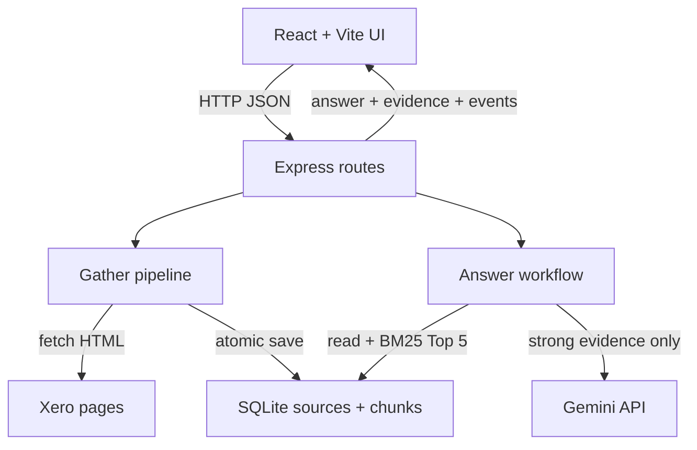

# Xero Research Assistant

A local-first TypeScript application that gathers four public Xero Australia pages, stores traceable evidence, and uses Gemini to answer questions. Reviewers can gather or refresh research, inspect sources, expand evidence, and see reuse, model, and failure activity.

## Setup and usage

### Requirements

- Node.js 22.13+ (required by the built-in `node:sqlite` module)
- npm
- A Gemini API key for real model answers and live evaluation only

```bash
git clone https://github.com/XiangXuX/xero-research-assistant.git
cd xero-research-assistant
npm install
```

Create the local configuration file:

```powershell
# Windows PowerShell
Copy-Item .env.example .env
```

```bash
# macOS/Linux
cp .env.example .env
```

Set `GEMINI_API_KEY=your_key_here` in `.env` for real model calls; obtain it from [Google AI Studio](https://aistudio.google.com/app/apikey). A ChatGPT subscription does not provide it. Git excludes `.env` and `data/*.db`.

| Variable | Default | Purpose |
| --- | --- | --- |
| `PORT` | `3001` | Express API port |
| `RESEARCH_DB_PATH` | `data/research.db` | SQLite database path |
| `FETCH_TIMEOUT_MS` | `45000` | Per-page timeout |
| `MODEL_PROVIDER` | `gemini` | Implemented runtime provider |
| `MODEL_NAME` | `gemini-3.1-flash-lite` | Runtime model |
| `MODEL_TIMEOUT_MS` | `30000` | Per-model-call timeout |
| `GEMINI_API_KEY` | empty | Server-only credential |

Run the web application:

```bash
npm run dev
```

Open [http://localhost:5173](http://localhost:5173). Vite serves React on 5173 and proxies `/api` to Express on 3001. `Cannot GET /` at port 3001 is expected because the API has no root page. Stop both processes with `Ctrl+C`.

| Task | UI | CLI | Network/model behaviour |
| --- | --- | --- | --- |
| Gather/reuse | **Gather research** | `npm run research:gather` | Fetches only missing/incomplete sources; otherwise reuses SQLite |
| Force refresh | **Refresh all** | `npm run research:refresh` | Refetches and reprocesses all four pages |
| Inspect data | **View stored chunks** | `npm run research:inspect` | SQLite only |
| Retrieve | Supporting Evidence | `npm run research:retrieve -- "What pricing plans does Xero offer in Australia?"` | SQLite only |
| Ask | **Ask with evidence** | `npm run research:ask -- "What pricing plans does Xero offer in Australia?"` | Never fetches Xero; calls Gemini only for strong retrieval |

Sources are configured in `src/server/research/sources.ts`. Add or replace a source there using a unique key and URL.

## System design



**Gather path.** `gatherResearch` reuses complete stored sources unless refresh is explicit. Otherwise it fetches HTML, removes common noise with Cheerio, creates passages of at most 1,200 characters, hashes the content, and saves it through `ResearchRepository`. Each source and its replacement chunks commit in one SQLite transaction. Failed refreshes preserve the previous content and successful `retrievedAt`; the UI distinguishes attempts from successful retrievals.

**Answer path.** `answerQuestion` reads stored chunks only. Lexical BM25, small synonym/metadata boosts, and query-term coverage select up to five passages labelled `E1`–`E5`. Weak evidence returns `insufficient_evidence` without Gemini; strong evidence sends the question and Top 5. The validator rejects malformed JSON, unknown IDs, missing citations, and mismatched inline markers. The backend maps valid IDs to stored text, title, URL, and date, preventing the browser from inventing evidence.

SQLite persists a `sources` row (key, URL, title, retrieval time, SHA-256, cleaned text) and ordered `chunks` linked by `source_id`. Asking and normal Gather reuse these records. A supported question may still make a new Gemini call.

## Tests and evaluation

Offline verification needs no API key or external access:

```bash
npm test
npm run typecheck
npm run build
```

The 21 Vitest tests use local HTML fixtures, mock fetch, in-memory SQLite, and a stub model at external boundaries while exercising real application logic. They cover reuse, insufficient evidence, ranking, persistence, invalid model output, repeated calls without refetching, and failed-refresh preservation. See [`evaluation/step-8-offline.json`](evaluation/step-8-offline.json).

After gathering live sources and setting the key, run:

```bash
npm run evaluation:live
```

This runs Supported, Multi-source, Insufficient-evidence, and Repeated/follow-up cases through the ordinary workflow and writes [`evaluation/real-model-run.json`](evaluation/real-model-run.json). The committed run records the model, dates, evidence, outputs, three model calls, four passing assessments, and unchanged retrieval dates. Because automated checks cannot prove semantic support, cited claims were also compared manually with stored passages.

## Design decisions

### SQLite instead of an external database

**Choice:** local SQLite through Node's built-in API. **Alternative:** managed PostgreSQL or MongoDB. SQLite gives this single-user, four-source MVP persistence, constraints, foreign keys, and transactions without another service, account, or infrastructure cost. Reconsider when concurrent users/instances need shared state, managed backup/high availability, or single-machine limits are reached.

### Lexical BM25 instead of embeddings/vector storage

**Choice:** in-process BM25 with transparent synonym and metadata boosts. **Alternative:** embedding/vector or hybrid retrieval. BM25 is deterministic, inspectable, offline, credential-free, and fast for this small product-language corpus. Reconsider when measured recall suffers from paraphrases or multilingual queries, or corpus growth makes linear scoring too slow.

## AI usage

Runtime AI is Google `gemini-3.1-flash-lite`, called server-side through the Gemini Interactions API with structured JSON, an 800-token output limit, minimal thinking, `store: false`, and a 30-second timeout. Application code—not Gemini—selects evidence, decides whether to call the model, validates IDs, and maps citations.

ChatGPT/Codex assisted planning, implementation, debugging, testing, evaluation, and documentation. One real evaluation exposed a plausible but unsupported plan name and overly short evidence excerpts. We retained complete passages, changed the follow-up to a directly supported question, and repeated the 21-test gate and four-case live run. The committed evaluation JSON records the result.

## Cost and limitations

First Gather and explicit Refresh request Xero; later Gather, retrieval, and questions reuse SQLite. Strong questions call Gemini; weak questions and offline tests do not. Xero access depends on site availability, while Gemini consumes quota and may incur charges. At scale, the main costs are refetching, rechunking, linear BM25 scoring, and model tokens.

Current limitations: local-only operation; no authentication, rate limiting, scheduler, user-managed sources, cloud deployment, or JavaScript-rendering crawler; extraction may break after page redesigns; lexical retrieval can miss paraphrases; citation validation cannot by itself prove semantic support; SQLite/in-memory scoring are not intended for high concurrency or large corpora. Refresh is transactional per source, not across all sources.

## Demo video

Pending — add the private or unlisted 3–5 minute recording URL here before submission.
