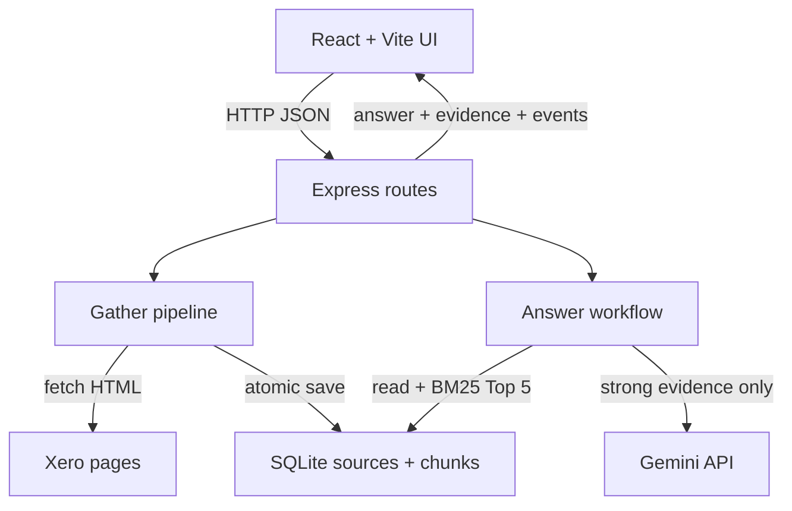

# Xero Research Assistant

A local-first TypeScript web application that gathers four public Xero Australia pages, persists traceable evidence, retrieves relevant passages, and uses Gemini to draft evidence-grounded answers. The UI lets a reviewer gather or refresh research, ask questions, inspect source URLs and retrieval times, expand evidence, and see reuse, model, and failure activity.

## Setup and usage

### Requirements

- Node.js 22.13+ (required by the built-in `node:sqlite` module)
- npm
- A Gemini API key for real model answers and live evaluation only

```bash
git clone https://github.com/XiangXuX/xero-research-assistant.git
cd xero-research-assistant
npm install
```

Create the local configuration file:

```powershell
# Windows PowerShell
Copy-Item .env.example .env
```

```bash
# macOS/Linux
cp .env.example .env
```

Set `GEMINI_API_KEY=your_key_here` in `.env` for real model calls. Create a key in [Google AI Studio](https://aistudio.google.com/app/apikey). A ChatGPT subscription does not provide this credential. `.env` and `data/*.db` are excluded from Git.

| Variable | Default | Purpose |
| --- | --- | --- |
| `PORT` | `3001` | Express API port |
| `RESEARCH_DB_PATH` | `data/research.db` | SQLite database path |
| `FETCH_TIMEOUT_MS` | `45000` | Per-page timeout |
| `MODEL_PROVIDER` | `gemini` | Implemented runtime provider |
| `MODEL_NAME` | `gemini-3.1-flash-lite` | Runtime model |
| `MODEL_TIMEOUT_MS` | `30000` | Per-model-call timeout |
| `GEMINI_API_KEY` | empty | Server-only credential |

Run the web application:

```bash
npm run dev
```

Open [http://localhost:5173](http://localhost:5173). Vite serves React on 5173 and proxies `/api` to Express on 3001. `Cannot GET /` at port 3001 is expected because the API has no root page. Stop both processes with `Ctrl+C`.

| Task | UI | CLI | Network/model behaviour |
| --- | --- | --- | --- |
| Gather/reuse | **Gather research** | `npm run research:gather` | Fetches only missing/incomplete sources; otherwise reuses SQLite |
| Force refresh | **Refresh all** | `npm run research:refresh` | Refetches and reprocesses all four pages |
| Inspect data | **View stored chunks** | `npm run research:inspect` | SQLite only |
| Retrieve | Supporting Evidence | `npm run research:retrieve -- "What pricing plans does Xero offer in Australia?"` | SQLite only |
| Ask | **Ask with evidence** | `npm run research:ask -- "What pricing plans does Xero offer in Australia?"` | Never fetches Xero; calls Gemini only for strong retrieval |

Sources are configured in `src/server/research/sources.ts`. Add or replace a source there using a unique key and URL.

## System design



**Gather path.** `gatherResearch` reuses a complete stored source unless refresh is explicit. Otherwise it calls `fetchPageHtml`, removes common HTML noise with Cheerio in `extractPageContent`, creates passages of at most 1,200 characters with `chunkContent`, hashes the content, and calls `ResearchRepository.saveSource`. Source and replacement chunks are committed in one SQLite transaction. A failed refresh leaves the previous text, hash, chunks, and successful `retrievedAt` unchanged; the UI distinguishes the failed attempt from the last successful retrieval.

**Answer path.** `answerQuestion` reads stored chunks only. `retrieveEvidence` uses lexical BM25, small synonym/metadata boosts, and query-term coverage to return at most five passages labelled `E1`–`E5`. Weak/absent evidence returns `insufficient_evidence` without Gemini. For strong retrieval, the backend sends only the question and Top 5 to Gemini. `parseAndValidateModelAnswer` rejects malformed JSON, unknown IDs, missing citations, and disagreement between inline `[E#]` markers and the citation array. The backend maps valid IDs to stored text, title, URL, and date before returning them to React, so the browser cannot invent evidence.

SQLite persists a `sources` row (key, URL, title, retrieval time, SHA-256, cleaned text) and ordered `chunks` linked by `source_id`. Asking and normal Gather reuse these records. A supported question may still make a new Gemini call.

## Tests and evaluation

Offline verification needs no API key or external access:

```bash
npm test
npm run typecheck
npm run build
```

The 21 Vitest tests use local HTML fixtures, mock fetch, an in-memory SQLite database, and a stub model at external boundaries while exercising real extraction, persistence, reuse, retrieval, answer, and validation logic. They cover the required reuse and insufficient-evidence cases plus ranking, persistence, invalid citations/provider output, repeated model calls without refetching, and failed-refresh preservation. See [`evaluation/step-8-offline.json`](evaluation/step-8-offline.json).

After gathering live sources and setting the key, run:

```bash
npm run evaluation:live
```

This runs Supported, Multi-source, Insufficient-evidence, and Repeated/follow-up cases through the ordinary workflow and writes [`evaluation/real-model-run.json`](evaluation/real-model-run.json). The committed run identifies the model/configuration and dates, records complete relevant evidence and outputs, passes all four cases, observes three model calls, and confirms unchanged source retrieval dates. Automated checks do not prove semantic entailment, so cited claims were also manually compared with the stored passages.

## Design decisions

### SQLite instead of an external database

**Choice:** local SQLite through Node's built-in API. **Alternative:** managed PostgreSQL or MongoDB. SQLite gives this single-user, four-source MVP persistence, constraints, foreign keys, and transactions without another service, account, or infrastructure cost. Reconsider when concurrent users/instances need shared state, managed backup/high availability, or single-machine limits are reached.

### Lexical BM25 instead of embeddings/vector storage

**Choice:** in-process BM25 with transparent synonym and metadata boosts. **Alternative:** embedding/vector or hybrid retrieval. BM25 is deterministic, inspectable, offline, credential-free, and fast for this small product-language corpus. Reconsider when measured recall suffers from paraphrases or multilingual queries, or corpus growth makes linear scoring too slow.

## AI usage

Runtime AI is Google `gemini-3.1-flash-lite`, called server-side through the Gemini Interactions API with structured JSON, an 800-token output limit, minimal thinking, `store: false`, and a 30-second timeout. Application code—not Gemini—selects evidence, decides whether to call the model, validates IDs, and maps citations.

ChatGPT/Codex assisted planning, implementation, debugging, tests, evaluation, and documentation. One real evaluation initially exposed a plausible but unsupported plan name and stored only short evidence excerpts. That result was not accepted as sufficient: the evaluation was changed to retain complete relevant passages and use a directly supportable follow-up, then the 21-test gate and four-case real run were repeated. This is recorded in the committed evaluation JSON.

## Cost and limitations

First Gather and explicit Refresh make Xero requests; later normal Gather, retrieval, and questions reuse SQLite. Strong questions and three supported cases in the current live evaluation call Gemini; weak questions and offline tests do not. Xero access consumes bandwidth and depends on site availability. Gemini consumes quota and may incur charges under current Google pricing. With growth, the main costs are refetching/rechunking, linear BM25 scoring, and model tokens for repeated supported questions.

Current limitations: local-only operation; no authentication, rate limiting, scheduler, user-managed sources, cloud deployment, or JavaScript-rendering crawler; extraction may break after page redesigns; lexical retrieval can miss paraphrases; citation validation cannot by itself prove semantic support; SQLite/in-memory scoring are not intended for high concurrency or large corpora. Refresh is transactional per source, not across all sources.

## Demo video

Pending — add the private or unlisted 3–5 minute recording URL here before submission.
