# Xero Research Assistant（中文说明）

[English README](README.md)

这是一个以本地运行为主的 TypeScript 研究应用。它抓取指定的 Xero Australia 公开页面，把可追溯证据保存到 SQLite，从已保存的段落中检索相关内容，再让 Gemini 根据证据起草答案；后端会验证引用是否来自本次检索结果。

Reviewer 可以在同一个网页中查看来源和抓取时间、Gather 或 Refresh 资料、提出问题、展开证据原文、点击来源 URL，以及查看运行状态与失败事件。

## 项目能做什么

- 抓取四个预先配置的 Xero Australia 公开页面。
- 清除常见 HTML 噪声，把正文切成长度受控的 chunks，并保存到 SQLite。
- 普通 Gather 复用已保存研究；普通提问绝不重新抓网页。
- 使用 BM25 给 chunks 排名，最多返回 Top 5。
- 只有检索对问题的覆盖足够强时才调用 Gemini。
- 拒绝格式错误、未知 evidence ID、或正文标记与 citation 数组不一致的模型输出。
- Refresh 失败时保留上一次成功的证据。
- 在页面显示来源、检索、模型、复用、刷新与失败事件。

## 从全新 clone 开始

### 需要准备

- Node.js 22.13 或以上；项目使用 Node 内置的 `node:sqlite`。
- npm；安装 Node.js 时会一起安装。
- 只有真实模型回答和 live evaluation 需要 Gemini API Key。Gather、查看数据、只检索证据、安全失败演示、类型检查、构建和离线测试都不需要 Key。

### 下载和配置

```bash
git clone https://github.com/XiangXuX/xero-research-assistant.git
cd xero-research-assistant
npm install
```

创建只在自己电脑使用的环境变量文件：

```powershell
# Windows PowerShell
Copy-Item .env.example .env
```

```bash
# macOS 或 Linux
cp .env.example .env
```

需要真实模型回答时，在 `.env` 填写：

```dotenv
GEMINI_API_KEY=your_key_here
```

Key 可从 [Google AI Studio](https://aistudio.google.com/app/apikey) 创建。ChatGPT 订阅不能代替它。`.env` 已被 Git 忽略；`.env.example` 是不含秘密、可以提交的模板。

## `.env.example` 每一项

| 变量 | 默认值 | 作用 |
| --- | --- | --- |
| `PORT` | `3001` | Express 后端端口。 |
| `RESEARCH_DB_PATH` | `data/research.db` | 本地 SQLite 文件位置。 |
| `FETCH_TIMEOUT_MS` | `45000` | 每次抓网页最多等待的毫秒数。 |
| `MODEL_PROVIDER` | `gemini` | 运行时模型服务；目前只实现 Gemini。 |
| `MODEL_NAME` | `gemini-3.1-flash-lite` | 发送给 Gemini API 的模型名称。 |
| `MODEL_TIMEOUT_MS` | `30000` | 每次模型请求最多等待的毫秒数。 |
| `GEMINI_API_KEY` | 空 | 只由 Express 在调用 Gemini 时读取的秘密。 |

## 启动 Web 应用

```bash
npm run dev
```

打开 [http://localhost:5173](http://localhost:5173)。Vite 在 5173 提供 React 前端，并把 `/api` 请求转发给 [http://localhost:3001](http://localhost:3001) 的 Express 后端。后端没有为 `/` 制作网页，所以直接打开 3001 看到 `Cannot GET /` 是正常的。停止时在运行 `npm run dev` 的终端按 `Ctrl+C`。

### Gather、Refresh、查看和提问

| 操作 | 页面入口 | 命令行 | 外部操作 |
| --- | --- | --- | --- |
| Gather / reuse | **Gather research** | `npm run research:gather` | 只有缺少完整存档时才抓取处理；否则复用 SQLite。 |
| 强制 Refresh | **Refresh all** | `npm run research:refresh` | 重新抓取并处理全部配置来源。 |
| 查看存储 | **View stored chunks** | `npm run research:inspect` | 只读 SQLite。 |
| 只看检索 | Supporting Evidence | `npm run research:retrieve -- "What pricing plans does Xero offer in Australia?"` | 只读 SQLite；不访问 Xero 或 Gemini。 |
| 根据证据提问 | **Ask with evidence** | `npm run research:ask -- "What pricing plans does Xero offer in Australia?"` | 读 SQLite；只有检索 strong 时调用 Gemini；不抓 Xero。 |

来源清单在 `src/server/research/sources.ts`。完整存档存在时，普通 Gather 产生 `SOURCE_REUSED`；明确 Refresh 才重新抓取，并且成功替换后才更新 `retrievedAt`。

## 架构与数据流

```mermaid
flowchart TD
    UI["React + Vite 前端"]
    API["Express API 后端"]
    GATHER["Gather 抓取流程"]
    ANSWER["Answer 问答流程"]
    DB["SQLite 来源 + chunks"]
    WEB["Xero 公开网页"]
    MODEL["Gemini API"]

    UI -->|"HTTP + JSON"| API
    API --> GATHER
    API --> ANSWER
    GATHER -->|"下载 HTML"| WEB
    GATHER -->|"事务式保存"| DB
    ANSWER -->|"读取 + BM25"| DB
    ANSWER -->|"仅强证据"| MODEL
    API -->|"答案 + 证据 + 事件"| UI
```



### Gather / Refresh 怎么运行

1. React 向 `POST /api/research/gather` 发送 JSON：Gather 是 `{ "refresh": false }`，Refresh 是 `{ "refresh": true }`。
2. Express 检查请求，再调用 gather service。
3. 普通 Gather 有完整数据就复用；Refresh 或缺数据时才从 URL 下载 HTML。
4. Cheerio 清除 script、导航、表单、Cookie/弹窗等噪声，再提取标题、段落、列表和表格文字。
5. Chunker 把正文切成最多 1,200 个字符的 chunks，并尽可能保留最多 180 个字符的段落重叠。
6. 程序计算 SHA-256 内容指纹，再用一个 SQLite transaction 提交 source 和新 chunks。
7. Express 用 JSON 返回 fetched、reused、failed 数量和事件，React 显示结果。

### Question / Answer 怎么运行

1. React 向 `POST /api/research/answer` 发送 `{ "question": "..." }`。
2. Express 先拒绝空问题或过长问题。
3. Answer service 只读 SQLite 中已有 chunks；它不能调用网页 fetcher 或 chunker。
4. BM25 把问题拆词，加入少量同义词和来源信息加权，给所有 chunks 排名，最多选择五段，临时标为 `E1` 至 `E5`。
5. 问题词语覆盖率把检索判断为 `strong`、`weak` 或 `none`。弱或没有证据时返回 `insufficient_evidence`，不调用 Gemini。
6. 证据 strong 时，只有问题和 Top 5 会发给 Gemini；模型提出包含 answer、citations 和证据不足标记的 JSON。
7. 后端只允许本次提供的 evidence ID，并要求答案中的 `[E1]` 等标记与 citations 数组完全一致。
8. 后端把合法 ID 对应回 SQLite 的标题、URL、抓取时间和原文，再把答案、证据、检索/模型信息与事件返回 React。

证据由后端组装，因为检索记录和合法 ID 名单都在那里。这样前端不能编造 citation，也不会把错误段落贴到答案下面。

## HTTP API

| 方法和地址 | 作用 | 主要结果 |
| --- | --- | --- |
| `GET /api/health` | 检查后端是否运行。 | `200` |
| `GET /api/research` | 返回已保存来源。 | `200` |
| `POST /api/research/gather` | Gather 或 Refresh。 | `200`；单来源失败写入结果 |
| `POST /api/research/retrieve` | 返回证据，不调用模型。 | `200`、`400` |
| `POST /api/research/answer` | 有证据约束的问答。 | `200`、`400`、`502`、`503` |
| `GET /api/research/sources/:sourceId` | 返回来源及 chunks。 | `200`、`400`、`404` |
| `POST /api/research/demo/refresh-failure` | 模拟 HTTP 503 安全失败。 | `200`；无旧资料时 `409` |

`400` 是输入不合法；`404` 是存档不存在；`409` 是当前状态不能演示；`502` 是外部模型运行失败或输出未通过验证；`503` 是模型未配置；其他内部错误使用 `500`。错误响应不含 API Key。

## SQLite 保存与复用

默认数据库是被 Git 忽略的本地文件 `data/research.db`。

- `sources` 表保存 key、URL、标题、成功抓取时间、SHA-256 指纹和清洗后全文。整数 `id` 是 primary key；key 和 URL 唯一。
- `chunks` 表保存小段文字、顺序和指向 `sources` 的 `source_id` foreign key。同一 source 的同一位置不能重复。
- Foreign key 已开启；删除 source 会连带删除 chunks。项目还开启 WAL 和五秒 busy timeout。

普通 Gather 直接复用 source 和 chunks，不访问网页，也不重复清洗切块。普通提问也读取这些数据；但证据 strong 时每次仍可能重新调用 Gemini，所以措辞可能不同。

Refresh 先抓取、清洗、切块，新内容准备好后才替换数据库。替换时使用 `BEGIN IMMEDIATE`、`COMMIT` 和 `ROLLBACK`。下载或清洗失败不会改变旧正文、hash、chunks 或成功抓取时间。页面分别显示 last attempted refresh 和 last successful retrieval。

## 离线自动化测试

```bash
npm test
npm run typecheck
npm run build
```

当前有 5 个测试文件、21 个 Vitest tests，覆盖 BM25 排名与 Top K、HTML 清洗与 chunk 长度、SQLite 持久化、来源替换、复用时不抓取不处理、证据不足、连续提问不重新抓取但分别调用模型、无效模型输出/citation、provider 失败、失败刷新保留旧数据，以及四类 evaluation 规则。

测试不需要 Key，也不访问 Xero 或 Gemini。HTML fixture、mock fetch、内存 SQLite 和 stub model 替代外部边界；真实的清洗、切块、repository、检索、workflow 和 citation 校验仍运行，所以不是 mock-only application。

验证记录：[`evaluation/step-8-offline.json`](evaluation/step-8-offline.json)。

## Evaluation

自动化测试证明确定的软件规则；evaluation 检查真实模型答案是否被证据支持。JSON 格式正确，不能自动证明语义正确。

Gather 完成且配置 `GEMINI_API_KEY` 后运行：

```bash
npm run evaluation:live
```

| Case | 证明什么 |
| --- | --- |
| Supported | 一个来源直接支持回答。 |
| Multi-source | 答案整合多个来源。 |
| Insufficient evidence | 检索弱时明确拒答且不调用模型。 |
| Repeated/follow-up | 抓取时间不变，但有支持的后续问题可再次调用模型。 |

命令写入 [`evaluation/real-model-run.json`](evaluation/real-model-run.json)：question、expected behaviour、完整 evidence、actual output、assessment、model/configuration、run date 和 retrieval dates，不记录 Key。已提交运行四类全部 PASS，观察到三次模型调用，来源抓取时间未变化。Reviewer 仍应人工确认每个重要陈述真的由引用原文支持。

## 两个设计决定

### 1. SQLite，而不是外部数据库

**选择。** 通过 Node 内置 API，把来源、正文和 chunks 放进一个本地 SQLite 文件。

**替代方案。** PostgreSQL、MongoDB 或其他云托管数据库。

**为什么现在适合。** 这是单用户、本地运行、四个来源的 MVP。SQLite 提供持久化、约束、foreign key 和 transaction，却不需要账号、网络设置、基础设施费用或额外服务进程。

**何时重选。** 多用户或多个后端实例需要共享数据、需要托管备份/高可用，或达到单机限制时迁移。

### 2. BM25，而不是 embedding/vector database

**选择。** 在 TypeScript 中拆词，用 BM25 加少量同义词和来源 metadata boost 排名。

**替代方案。** 生成 embeddings 并查询 vector database，或使用 BM25 + vector 的 hybrid retrieval。

**为什么现在适合。** 资料量小，问题与页面通常共享产品词语。BM25 透明、可检查、此规模下够快、可离线运行，不需要 embedding Key，也没有 embedding/向量托管费用。

**何时重选。** 全量扫描变慢、改写问题导致召回差、需要多语言，或 evaluation 证明检索质量不足时采用 vector/hybrid。

## AI Usage

### 运行时 AI

Google Gemini 由 Express 后端通过 Gemini Interactions API 访问，Key 来自 `GEMINI_API_KEY`，默认模型是 `gemini-3.1-flash-lite`。请求使用结构化 JSON、最多 800 个输出 token、minimal thinking、不请求 provider 保存，并有 30 秒 timeout。

Gemini 是受限制的答案提议者，不是事实来源。代码决定证据是否 strong、提供哪些 passages、哪些 ID 合法、输出是否有效，以及最终返回哪些存档证据。

### 开发 AI

ChatGPT/Codex 辅助规划、实现、调试、测试与 evaluation 设计和文档。AI 辅助内容通过代码核对、自动测试、真实模型 evaluation 和人工证据阅读检查。运行项目不需要开发助手凭证。

## 网络与模型成本

| 操作 | Xero 请求 | Gemini 请求 | 复用研究 |
| --- | --- | --- | --- |
| 第一次 Gather | 缺失/不完整来源会请求 | 否 | 已完整来源 |
| 后续普通 Gather | 全部完整时无请求 | 否 | 是 |
| Refresh all | 每个来源一次 | 否 | 替换失败时保留旧数据 |
| Retrieve | 否 | 否 | 是 |
| Ask，strong | 否 | 是 | 是 |
| Ask，weak/none | 否 | 否 | 是 |
| Offline tests | 否 | 否 | Fixture/mock/内存 SQLite |
| Live evaluation | 问答案例内不抓网页 | 已提交运行调用三次 | 是 |

Xero 请求消耗网络时间并依赖网站可用性。Gemini 调用消耗 Google 配额，也可能按当期价格收费。程序在 provider 返回 usage 时记录 token，但不计算金额。

数据增长后，主要本地成本是保存/重新切分更多文字，以及每次 BM25 线性计算更多 chunks。模型输入限制为 Top 5，但 passage 长度和重复 strong 问题仍影响 token。

## 当前限制与未完成内容

- 只支持本地开发；没有云部署或公开 URL。
- 没有登录、权限、用户隔离、rate limiting 或生产 secret management。
- 四个固定公开 HTML 来源；没有用户来源列表、定时任务、crawler 或 JavaScript 浏览器抓取。
- HTML 清洗依赖页面结构，网页改版后可能需要维护。
- 词语检索可能漏掉不同措辞的相同意思；这不是 vector search。
- 强弱判断是 query-term coverage 规则，不是训练过的 classifier。
- Citation 校验检查格式和合法 ID，不能单独证明完整语义；仍需人工 evaluation。
- SQLite 和内存全量 BM25 不面向高并发或超大资料库。
- Refresh 对每个来源分别使用 transaction，不是所有来源共同成功或失败。
- 不计算 Gemini 实际金额，也不保证 provider/网站始终可用。

## 项目目录

```text
src/client/                 React 页面与浏览器 API 调用
src/server/routes/          Express HTTP 检查和响应
src/server/research/        抓取、清洗、切块、保存、Gather/Refresh
src/server/retrieval/       BM25 检索和覆盖强弱判断
src/server/model/           Gemini、问答流程、citation 校验
src/server/evaluation/      四类真实模型 evaluation runner
src/shared/                 前后端共用 TypeScript contracts
tests/                      离线 Vitest unit/integration tests
evaluation/                 验证与真实模型记录
data/                       本地 SQLite；数据库文件被 Git 忽略
```

## 演示视频

待录制——提交前把最终视频 URL 填在这里。
